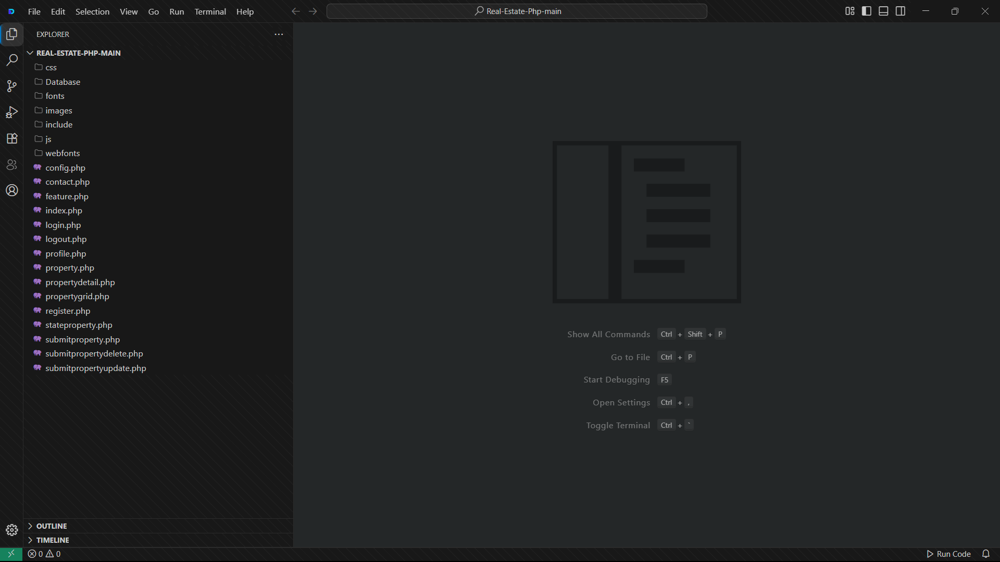
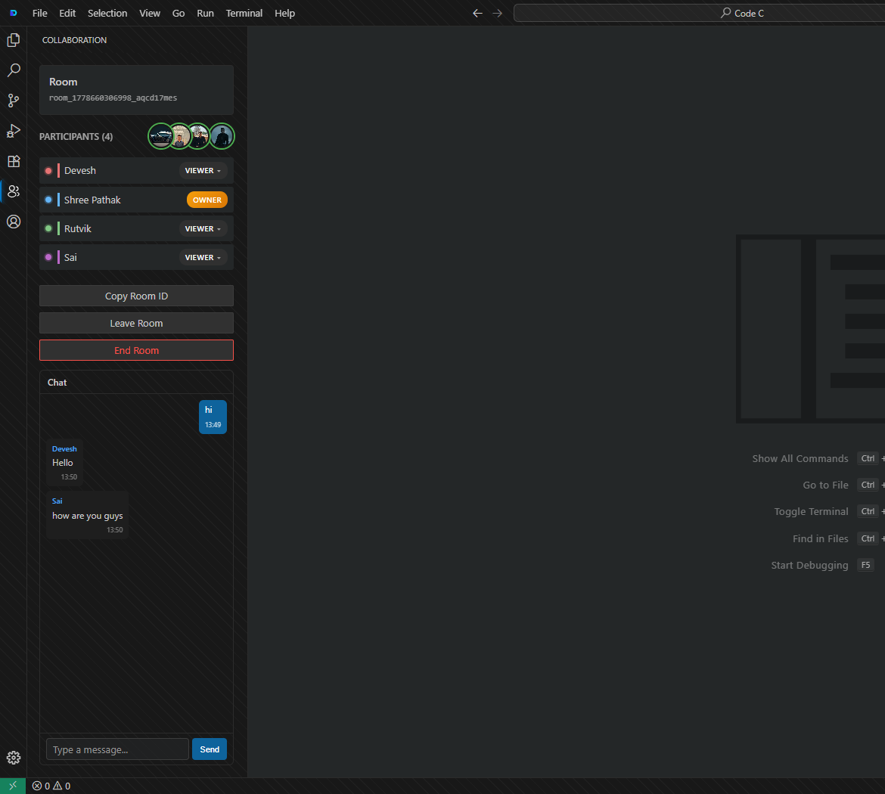
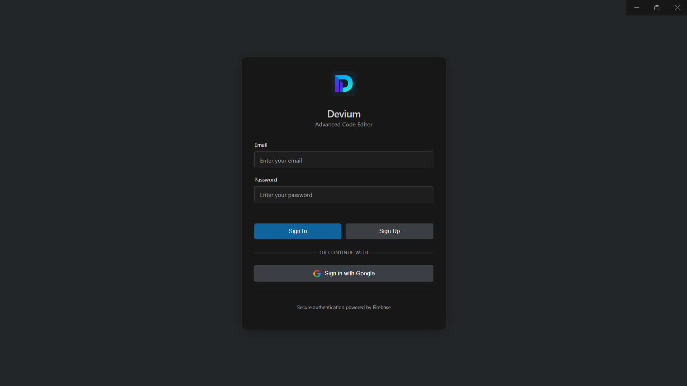
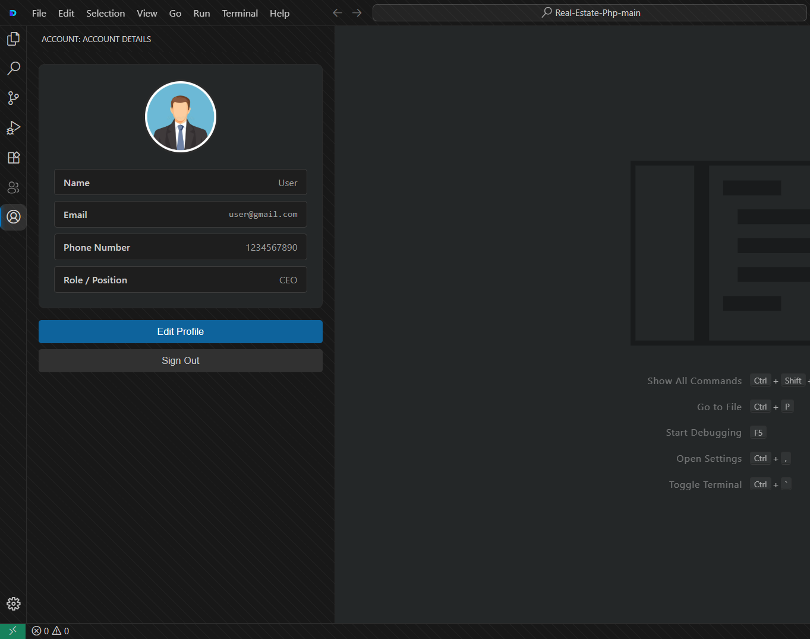

<div align="center">
  
  <h1>Devium</h1>

  **A Powerful Realtime Collaborative Code Editor Desktop Application**

  Built for developers and students to collaborate on code seamlessly in realtime, anytime, anywhere.

  <p align="center">
    
    
    
    
  </p>

  [](https://devium-mu.vercel.app/)

</div>

---

## ✨ Features

- **👯‍♂️ Realtime Multi-Cursor Editing** - See exactly what your team is typing, instantly.
- **💬 Realtime Chat** - Communicate without ever leaving your coding environment.
- **🔐 Role-Based Access** - Manage your collaborative workspace with Owner, Editor, and Viewer permissions.
- **🔄 Instant Synchronization** - Code and file changes are synchronized across all connected clients with zero latency.
- **🚪 Room Creation** - Spin up secure coding rooms and invite collaborators with a single click.

---

## 📸 Sneak Peek

### Dashboard & Workspace


### Realtime Collaboration Room


### User Authentication & Profile
| Signup | User Profile |
| :---: | :---: |
|  |  |

---

## 🚀 Getting Started

### Prerequisites

Ensure you have the following installed on your local machine:
- [Node.js](https://nodejs.org/en/) (v16.x or higher)
- [Git](https://git-scm.com/)
- [Yarn](https://yarnpkg.com/) or npm

### Installation

1. **Clone the repository:**
   ```bash
   git clone https://github.com/Rutvik-Jathar/Devium.git
   cd devium
   ```

2. **Install dependencies:**
   ```bash
   npm install
   # or
   yarn install
   ```

3. **Set up Environment Variables:**
   Create a `.env` file in the root directory and add your Firebase configuration details:
   ```env
   REACT_APP_FIREBASE_API_KEY=your_api_key
   REACT_APP_FIREBASE_AUTH_DOMAIN=your_auth_domain
   REACT_APP_FIREBASE_PROJECT_ID=your_project_id
   REACT_APP_FIREBASE_STORAGE_BUCKET=your_storage_bucket
   REACT_APP_FIREBASE_MESSAGING_SENDER_ID=your_messaging_sender_id
   REACT_APP_FIREBASE_APP_ID=your_app_id
   ```

4. **Run the development server:**
   ```bash
   npm run dev
   # or
   yarn dev
   ```

5. **Start the Electron app (in a separate terminal):**
   ```bash
   npm run electron:start
   ```

---

## 🛠️ How It Works

Devium utilizes a powerful technology stack to deliver a seamless collaborative experience:

1. **The Editor Engine**: We integrate the **Monaco Editor** (the same engine powering VS Code) to provide an authentic, feature-rich coding environment within our **React** interface.
2. **Realtime Engine**: **Socket.io** establishes a persistent, low-latency connection between clients for instantaneous cursor movements, text changes, and chat messages.
3. **State & Auth**: **Firebase** handles robust user authentication, securely manages room metadata, and ensures state consistency.
4. **Desktop Environment**: **Electron** wraps the web technologies into a native desktop application, granting deep system access and a unified user experience.

---

## 📥 Download

Ready to revolutionize your team's coding workflow? 

**[Download the latest version of Devium here!](https://devium-mu.vercel.app/)**

---

## 🔮 Future Enhancements

- [ ] Integrated Terminal Support
- [ ] Version Control (Git) Integration
- [ ] Voice / Video Call integration within rooms
- [ ] Support for multiple themes and custom syntax highlighting
- [ ] AI-Powered Code Suggestions

---

## 👥 Contributors

This project is brought to you by:

* **[Rutvik Jathar](https://github.com/Rutvik-Jathar)** 
* **[Devesh Pathak](https://github.com/devesh-pathak)** 

---

<div align="center">
  <i>If you found this project helpful, please consider leaving a ⭐️ on the repository!</i>
</div>
